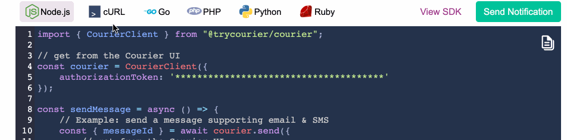

import Image from "@theme/IdealImage";
import GifWrapper from "@site/src/components/GifWrapper";

# How to Send a Notification

> A step-by-step guide to generating the code snippet required to integrate a Notification into your codebase and send it to your users.

## Send a Notification

Once you have completed the [Design](design-a-notification.mdx) and [Preview](how-to-preview-notification.mdx) steps, the last step is to generate a code snippet you can test and integrate with your codebase.

<Image
  img={require("../../assets/guides/send-notification/send-notification-tab.png")}
  alt="Send Tab"
/>

To send a Notification, a developer needs to integrate the code snippet generated by Courier with your codebase. Integration options include [Courier's SDKs](https://github.com/trycourier) and making an HTTP request directly to the Courier [Send API](../../reference/send/intro.mdx).

If you have missed any of the steps required to send the Notification, you will see a call to action for that step in the Send Tab.

<Image
  img={require("../../assets/guides/send-notification/send-notification-tab-warnings.png")}
  alt="Call to Action to Successfully Send a Notification"
/>

### Generating a Code Snippet to Integrate in Your Codebase.

Once you have completed the required steps, you'll be able to generate a code snippet and send a test Notification. 

<Image
  img={require("../../assets/guides/send-notification/send-notification-code.jpeg")}
  alt="Code Snippet"
/>

To generate the right code snippet for your database to start sending your Notification to live users, confirm you have the right selection for these three settings:

1. Select your programming stack
2. Set the notification event
3. Recipient id setting

### Sending a Test Notification

After you configure the Code Snippet, setting these values will allow you to send a test Notification from the Send Tab:

4. Select a test event
5. Select the brand (Email notifications)
6. Send a test notification
7. Copy the code snippet

## Sending Prerequisites

### 1. Select the Programming Stack for Your Code Snippet

<GifWrapper width={952} height={300} caption="Choose Your Programming Stack">

</GifWrapper>

- Switch programming languages to generate the code snippet in the language needed to integrate the Notification into your codebase. 
- Clicking [View SDK](https://github.com/trycourier) in the Send tab will link you directly to the SDK for the language you've selected.

### 2. Select a Notification Event

<Image
  img={require("../../assets/guides/send-notification/send-notification-event.png")}
  alt="Select an Event"
/>

- The [Notification Event](https://help.courier.com/en/articles/4189555-send-basics-how-notifications-are-triggered-and-sent-with-courier) included in the code snippet is used to identify and trigger the correct Notification. <!-- Link follow-up doc -->
- This `event` can be either the Notification ID or the Event ID mapped to it in the Event Settings.

### 3. The Recipient Id

- A unique identifier associated with the recipient of the delivered message.
- The string in the code snippet is randomly generated to enable the test send.
- You can click into the field and customize it.
- When integrating into your codebase, your app will need to insert the correct Receipient ID into the `send` command.

## Sending a Test Notification Prerequisites

Once you have completed steps 1-3 to generate the correct code snippet, complete steps 4 and 5 to send a test Notification via your integrated channels.

To send a test notification, you'll need:

- A valid [Integration](https://help.courier.com/en/articles/4382644-how-to-add-an-integration-to-a-channel) added to at least one Notification Channel. <!-- Link follow-up doc -->
- A [Test Event](how-to-preview-notification.mdx) in the Preview tab with valid recipient data in the profile 

### 4. Select a Test Event

Select the Test Event with the profile data of the recipient for your test Notification. 

<Image
  img={require("../../assets/guides/send-notification/send-notification-test-event.png")}
  alt="Select a Test Event"
/>

**Read More:** [Creating Test Events in the preview tag.](how-to-preview-notification.mdx)

### 5. Specify the Brand

If you are testing an Email Notification, you can specify which of your [Brand Email Templates](../brands/how-to-use-brands-to-customize.mdx) you want to have applied to the test. If you don't specify a brand, Courier will apply your [Default Brand](../brands/customize-default-brand.mdx).

<Image
  img={require("../../assets/guides/send-notification/send-notification-select-brand.png")}
  alt="Select a Brand"
/>

### 6. Send a Test Notification

Once you've completed steps 1-5, click `Send Notification`. Check the [Data Logs](https://help.courier.com/en/articles/4364860-using-the-notification-data-logs) to review the results.
<!-- Link follow-up doc -->
<Image
  img={require("../../assets/guides/send-notification/send-notification-test-send.png")}
  alt="Send a Test Notification"
/>

### 7. Copy the Code Snippet

You can click on the `Copy to Clipboard` button to paste and integrate it into your codebase or share it with your developer through other channels.

<Image
  img={require("../../assets/guides/send-notification/send-notification-copy-button.png")}
  alt="Copy your Code Snippet"
/>

If you're not sure how to do that, here are a few options for sharing the Code Snippet:

- Sharing code snippets [via Slack](https://slack.com/slack-tips/share-code-snippets).
- Sharing code snippets [via MS Teams](https://support.microsoft.com/en-us/office/send-code-snippets-in-a-message-in-teams-5406fe2b-2771-4b9a-bd73-656914f6ab3c).
- Send the Code Snippet as plain text [via Gmail](https://www.lifewire.com/how-to-send-a-message-in-plain-text-from-gmail-1171963#:~:text=To%20send%20an%20email%20in,re%2Dselect%20the%20menu%20option.).
- Create and share a [Github Gist](https://docs.github.com/en/github/writing-on-github/creating-gists#creating-a-gist).