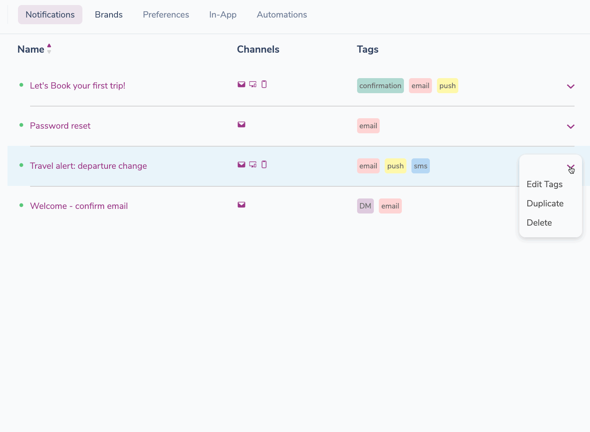
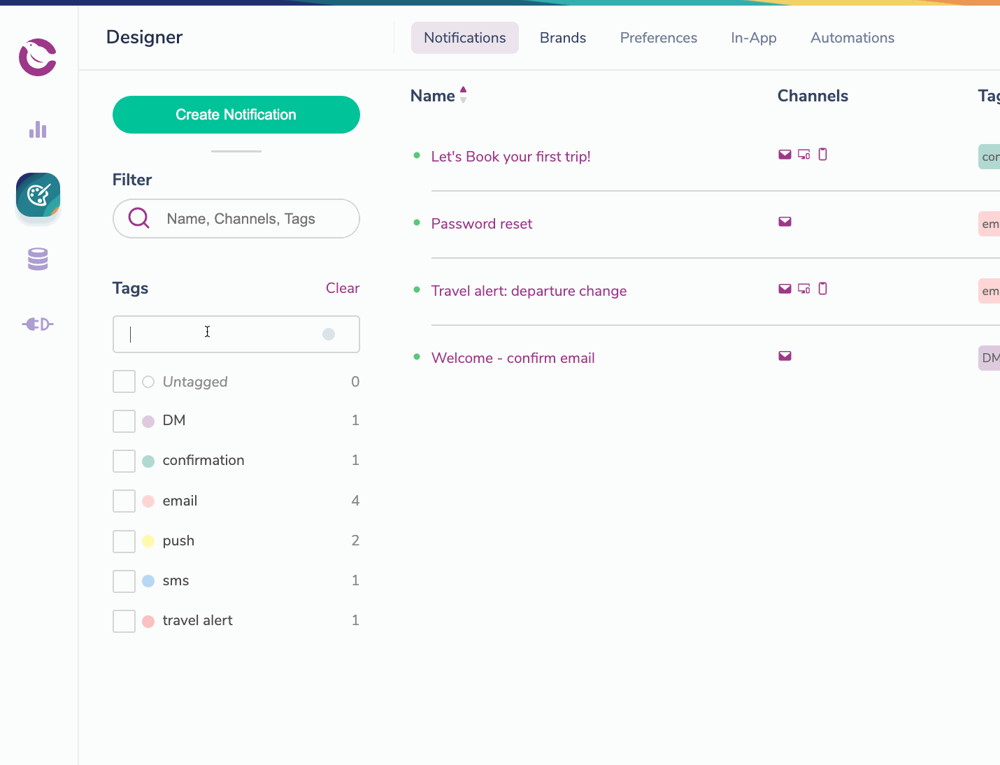

import Image from "@theme/IdealImage";
import GifWrapper from "@site/src/components/GifWrapper";

# Organizing and Filtering Notifications with Tags

> Adding tags to your Notifications helps you filter and search your Courier notifications.

When you have a long list of notifications, adding tags allows you to search and filter your list of Notifications by multiple, custom parameters in addition to Name and Channel. Tags are especially valuable because you can filter on more than one tag at a time, while the search field only allows you to search one term at a time.

<Image
  img={require("../../assets/guides/notification-tags/tags-designer.png")}
  alt="Notification Tags Overview"
/>

## Creating, Managing and Deleting Notification Tags

Tags can be managed in one of two places: 

1. The `Tags` tool in the Notification Designer 
2. A Notification's dropdown menu in the Notifications list view.

<Image
  img={require("../../assets/guides/notification-tags/tags-create.png")}
  alt="Creating Tags"
/>

## Create, Tag or Untag Using the Notification List View Modal

- Open the Notification's dropdown menu on the far right of its list row.
- Type a new tag name into the Create Tag field and assign it a color.
- Once the tag is created, click on it to assign it to the Notification.
- To tag the Notification with an existing tag, simply click on the tag name.   

:::info Note

You **cannot** change the tag color or delete tags in the dropdown manager.

:::

<GifWrapper width={1129} height={827} caption="Creating a Notification Tag">

</GifWrapper>

## Create, Edit Tag Color, and Delete Tags With the Tags Tool

- To create a tag in the filter view, simply type a tag name into the create tag field and hit return. 
- To edit a tag's color, click on the color indicator next to the tag name.
- To edit a tag name, click into the tag's name field.
- To delete a tag, click on the tag's count number.

:::info Note

You **cannot** assign a tag to a notification from this view. 

:::

<GifWrapper width={1144} height={875} caption="Editing a Notification Tag">

</GifWrapper>

## Filtering and Searching Your Notifications

You can search your Notifications by a single Name, Channel or Tag with the Filter tool.

<Image
  img={require("../../assets/guides/notification-tags/tags-filter.png")}
  alt="Filter Tags"
/>

The Tags tool allows you filter down your Notification by selecting multiple tags.

<Image
  img={require("../../assets/guides/notification-tags/tags-checkbox.png")}
  alt="Filtered Notification"
/>

You can also use the Filter search in combination with the Tags tool to narrow the results of selected tags.

<Image
  img={require("../../assets/guides/notification-tags/tags-filter-check.png")}
  alt="Multiple Filtering Options"
/>