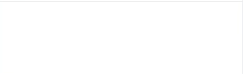

import Image from "@theme/IdealImage";

# Toast

Github Docs: [@trycourier/react-toast](https://github.com/trycourier/courier-react/tree/main/packages/react-toast)



In addition to Inbox, you can trigger a Toast message to appear when a new message has been received. It is optional and not required to be used with Inbox.  It can even be used standalone if that is what your application requires.

## Installation

Similarly to `Inbox`, `Toast` also requires the `CourierProvider`.  

```
yarn add @trycourier/react-provider
yarn add @trycourier/react-toast
```

or 

```
npm i @trycourier/react-provider
npm i @trycourier/react-toast
```

```ts
import { CourierProvider } from "@trycourier/react-provider";
// const CourierProvider = require("@trycourier/react-provider").CourierProvider;

import { Toast } from "@trycourier/react-inbox";
// const Toast = require("@trycourier/react-inbox").Toast;

function App() {
  // YOUR_CLIENT_KEY is a public facing key and can be found at https://app.courier.com/channels/courier
  return (
    <CourierProvider userId={yourUserId} clientKey={process.env.YOUR_CLIENT_KEY}>
      <Toast />
    </CourierProvider>
  );
}
```

## useToast

If you do not want to use Courier Push to trigger a toast notification then you can always invoke the toast locally with the useToast hook. Below is an example creating a notification from the client rather than creating it from a transport. Do not forget to wrap this component with a CourierProvider somewhere up the component hierarchy chain.

```ts
import { CourierProvider } from "@trycourier/react-provider";
// const CourierProvider = require("@trycourier/react-provider").CourierProvider;

import { Toast, useToast } from "@trycourier/react-toast";
// const CourierToast = require("@trycourier/react-toast");


const MyComponent: React.FunctionComponent = () => {
  //We can access this because the parent is a `CourierProvider`
  const [show] = CourierToast.useToast();

  return (
    <button onClick={() => show("You just made a notification 🎉")}></button>
  );
};

const App: React.FunctionComponent = () => {
  return (
    <CourierProvider userId={USER_ID} clientKey={CLIENT_KEY}>
      <CourierToast.Toast />
      <MyComponent />
    </CourierProvider>
  );
};
```