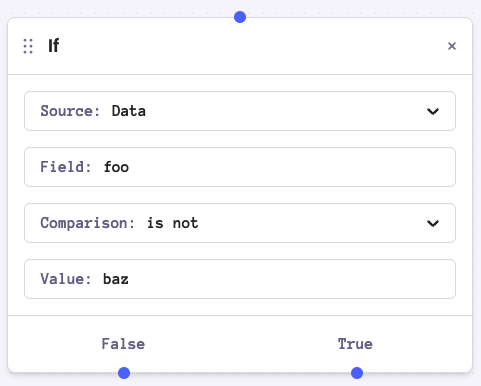
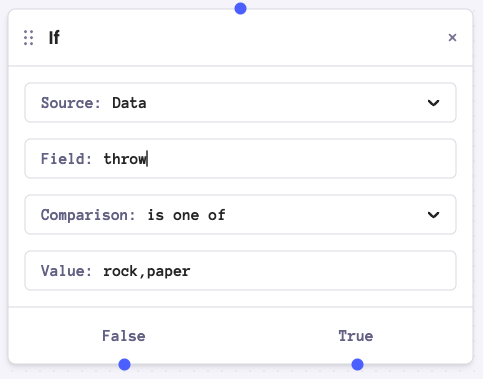
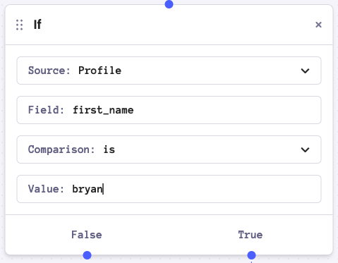
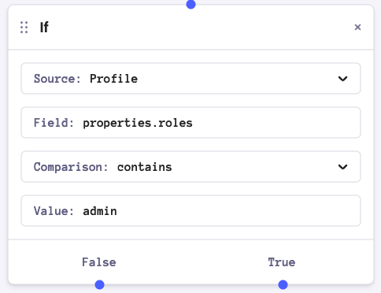
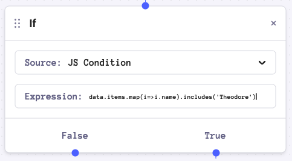
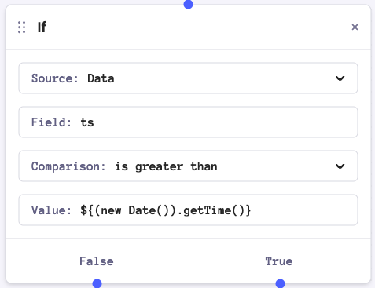

# Conditional Control Flow

import Image from "@theme/IdealImage";
import videoThumbnail from "./assets/video-thumbnail.png";
import controlFlowThumb from "./assets/control-flow.png";
import connectingNodesURL from "./assets/connecting-nodes.mp4";
import draggingNodesURL from "./assets/dragging-nodes.mp4";
import ifNodeURL from "./assets/if-node.mp4";
import switchNodeURL from "./assets/switch-node.mp4";
import controlFlow from "./assets/new-control-flow.mp4";
import CodeBlock from "@theme/CodeBlock";

export const TableCellCode = ({ value }) => {
  return <CodeBlock language="json">{JSON.stringify(value, null, 2)}</CodeBlock>;
};

## Introduction

Automations can conditionally execute a branch of the workflow. This can be useful in any case where you may want to change the actions of an automation based on certain data sent with the template.

Two nodes are available to execute control flow: `If` and `Switch`. 

## If Node

The `If` node is a simple conditional node that evaluates a condition and routes to the True or False branch. The `If` node accepts a single condition and routes to the True branch if the condition evaluates to true, otherwise it routes to the False branch.

For example, you may want to send one template if one data field represents a certain value, or another template if it does not:

<video width="783" loop autoPlay muted controls poster={videoThumbnail}>
  <source src={ifNodeURL} />
</video>

## Switch Node

For situations where a simple if true / false branch is insufficient, a
switch node is available. The switch node accepts an arbitrary number of
conditions and routes to the branch of the first condition to evaluate to true.
If no conditions evaluate to true, the default branch is used.

<video width="783" loop autoPlay muted controls poster={videoThumbnail}>
  <source src={switchNodeURL} />
</video>

## Condition Sources

The `If` and `Switch` nodes have four different source options: data, profile, step ref and JS condition. These sources control whether to follow the True path or the False path by evaluating the sources.

### Data

Compare a field within the `data` key within the automation context with a value. For example:

| Condition                                                       | Automation Payload                                                              | Evaluation |
| --------------------------------------------------------------- | ------------------------------------------------------------------------------- | ---------- |
|     | <TableCellCode value={{recipient: "user123", "data": {"foo": "bar"}}} />        | True       |
|  | <TableCellCode value={{recipient: "user123", "data": {"throw": "scissors"}}} /> | False      |

### Profile

Compare a field within the `data` key within the automation context with a value. For example:

| Condition                                                               | Automation Payload                                                                                                                 | Evaluation |
| ----------------------------------------------------------------------- | ---------------------------------------------------------------------------------------------------------------------------------- | ---------- |
|    | <TableCellCode value={{recipient: "user123", "profile": {"user_id": "user123", first_name: "bryan" }}} />                          | True       |
|  | <TableCellCode value={{recipient: "user123", "profile": {"user_id": "user123", properties: { roles: ["admin", "developer"] }}}} /> | True       |

### Step Ref

Step Ref is designed for you to check the current value of a Send node, mainly it's status. See the screenshot below or view the [tutorial](#control-flow-tutorial). In order to use Step Ref, you must have a Send node and have the alias of the Send node defined in its configuration.

`CLICKED` | `DELIVERED` | `ENQUEUED` | `FILTERED` | `OPENED` | `SENT` | `SIMULATED` | `UNDELIVERABLE` | `UNMAPPED` | `UNROUTABLE`

<Image img={require("./assets/control-flow.png")} alt="Automation Control Flow" />

### JS Condition

Sometimes the value checking is not open ended enough to evaluate a condition. Using the JS Condition you can:

- manipulate the field value before comparing
- check for key existence
- Comparing date diffs as ISO strings
- manipulate nested arrays and objects

We will evaluate the manipulation into a Javascript Boolean after the equation

| Condition                                                                | Automation Payload                                                                                                       | Evaluation |
| ------------------------------------------------------------------------ | ------------------------------------------------------------------------------------------------------------------------ | ---------- |
|  | <TableCellCode value={{recipient: "user123", data: {names: [{name: "Alvin"}, {"name": "Simon"}, {"name": "Theo"}] }}} /> | False      |

#### JS Condition Values

Within the Data, Profile and Step Ref Sources, you may also use JS String evaluation in the value field

| Condition                                                 | Automation Payload                                                           | Evaluation |
| --------------------------------------------------------- | ---------------------------------------------------------------------------- | ---------- |
|  | <TableCellCode value={{recipient: "user123", data: {ts: 1095869760000 }}} /> | True       |

## Control Flow Tutorial

Below you can find a walkthrough of a sample control flow using step references to check the status of a previously sent notification. The control flow node will check against the status of a previous node with the value of the `step ref`.

<video width="783" loop autoPlay muted controls poster={controlFlowThumb}>
  <source src={controlFlow} />
</video>
```
