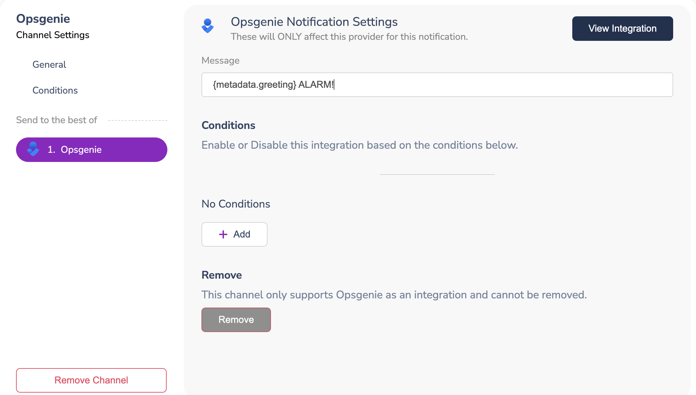
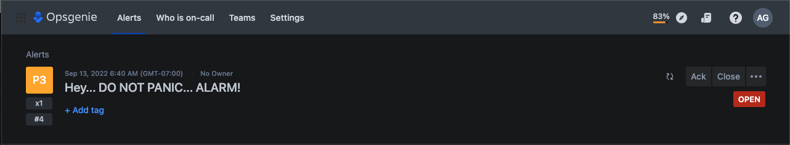

# Opsgenie

## Profile Requirements

Opsgenie does not require any profile data. If you include the Opsgenie channel in your notification template, Courier will route the notification to Opsgenie.

```json
{
  "message": {
    // Recipient Profile
    "to": {},
    // Template with Opsgenie channel
    "template": "TEMPLATE_ID",
  }
}
```

## Configuration

:::info
To configure the Opsgenie provider, **you must set a value in the `Message` field in the channel configuration**. You can use a static message or enhance it by using the data property in the API call payload.
:::



To add dynamic content to your message, include the data property in the API call payload:

```json
{
  "message": {
    "data": {
      "metadata": {
        "greeting": "Hey... DO NOT PANIC..."
      }
    },
    "providers": {
      "opsgenie": {
        "override": {
          "config": {
            "apiKey": "YOUR API KEY"
          }
        }
      }
    },
    "template": "TEMPLATE_ID",
    "to": {}
  }
}
```

After processing the request, the notification will include the value from the `data` property.


## Override

You can use overrides to change the configuration or request body that Courier sends to Opsgenie. For example, you can change the API key or the message body.

:::info
If you are using Opsgenie in the Europe region, ensure that you use the URL `https://api.eu.opsgenie.com/v2` and the apiKey associated with your EU region.
:::

```json title=Provider Overrides for Opsgenie
{
  "providers": {
    "opsgenie": {
      "override": {
        "config": {
          "apiKey": "YOUR API KEY",
          "url": "URL"
        },
        "headers": {},
        "body": {
          "message": "YOUR MESSAGE"
        }
      }
    }
  }
}
```
