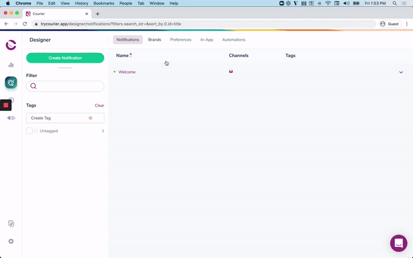

import Image from "@theme/IdealImage";
import GifWrapper from "@site/src/components/GifWrapper";
import YoutubeEmbed from "@site/src/components/YoutubeEmbed";

# Customize Your Default Brand

> Adding your default logo, brand colors, footer and social links for your email notifications.

Your Default Brand, along with any Custom Brand, can be customized and renamed. The default brand cannot be deleted.

## Customizing Your Default Brand is Important Because:

- Every email notification you create uses the Default Brand unless you manually disable Brands in the Notification settings.
- If you enable brands on a notification, your Default Brand will be the fallback for any Send API call that does not specify a brand in the user profile.

<GifWrapper width={667} height={375} caption="Brands Designer">

</GifWrapper>

## Setting A Custom Brand As Your Default

To set a custom brand as your default, open the Brand settings and click 'Set As Default.'

<Image
  img={require("../../../assets/guides/courier-app/default-brand-settings.png")}
  alt="Brand Designer Settings"
/>

<Image
  img={require("../../../assets/guides/courier-app/default-brand-modal.png")}
  alt="Brand Designer Settings Modal"
/>

**Watch Courier live:** [Building and sending brands via the Brands API](https://www.youtube.com/watch?v=0hnc8PUcWTg)