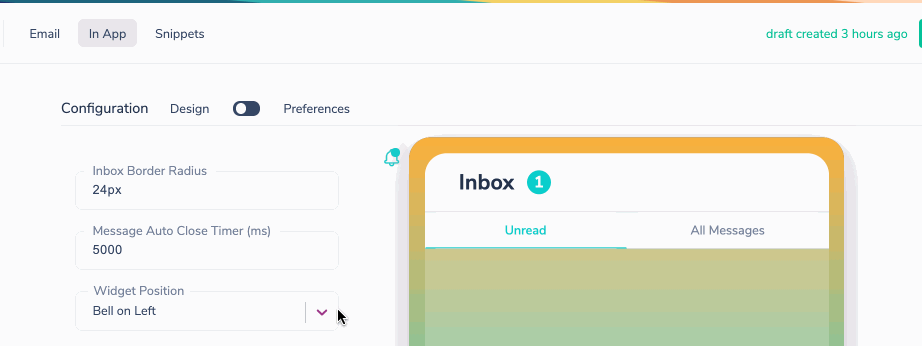

import YoutubeEmbed from "@site/src/components/YoutubeEmbed";
import Image from "@theme/IdealImage";
import GifWrapper from "@site/src/components/GifWrapper";

# Branding Courier Toast and Inbox

> Step-by-step guide to customizing the look and feel of your in-app toast and inbox using the Courier Brands Designer.

## Using the Courier In-App Brand Designer

You can customize the look and feel of the Courier in-app toast and inbox using the Brands designer. To get started, go to the [Brands](https://app.courier.com/designer/brands) tab in the Designer, open a brand then select **In-App**.

<Image
  img={require("../../../assets/guides/courier-app/inbox-brands-designer.png")}
  alt="Brands Designer"
/>

### Defining Your Brand Colors

If you previously set your brand colors for email, those colors are applied to In app as well. If not, you can define your brand colors in the in-app designer using [hex codes](https://htmlcolorcodes.com/).

<Image
  img={require("../../../assets/guides/courier-app/inbox-brands-colors.png")}
  alt="Brand Colors" width={350}
/>

The **Primary** color will be used on the bell icon, unread message count and unread indicator, and the auto close timer bar on toast messages.

### Inbox Border Radius

You can define the curve on the corners of your inbox using the Inbox Border Radius field. 

:::info

Please be sure to include **px** at the end of your number.

:::

### Message Auto-Close Timer

The Message Auto Close Timer field sets the amount of time your toast notification will stay open before auto closing. 

You can see the auto close timer in action within your Courier workspace when you use the 'Send' tab and receive the toast notification that action triggers.

<Image
  img={require("../../../assets/guides/courier-app/inbox-countdown.png")}
  alt="Auto-Close Countdown"  width={300}
/>

## Customizing Widgets

Courier Inbox widgets can be customizable in order to match your brand.

### Widget Position

You can set the launch location of the widget relative to the bell icon. This will allow you to embed the widget in the top, left or right hand navigation bar.

<GifWrapper width={845} height={325} caption="Widget Position">

</GifWrapper>

## Customizing In-App Icons

Courier's In-App Inbox uses icons in two places: the bell icon which indicates new messages, and the message icon, which is used in the toast message and inbox.

 ### Bell Icon

 The bell icon is customizable. To set a custom bell icon, drag and drop a PNG or JPG file with a width of 25px or more.

<Image
  img={require("../../../assets/guides/courier-app/inbox-widget-icon.png")}
  alt="Widget Icon Upload" width={400}
/>

### Message Icon

The message icon is used on the in app toast and in the inbox. To set a custom message icon, drag and drop a PNG or JPG file with a width of 25px or more.

<Image
  img={require("../../../assets/guides/courier-app/inbox-message-icon.png")}
  alt="Inbox Message Icon"
/>

You can disable the message icon if you don't want it to appear in the toast or inbox by checking the Disable Message Icon box. You cannot disable it in just one of those locations.

<Image
  img={require("../../../assets/guides/courier-app/inbox-disable-icon.png")}
  alt="Disable Message Icon" width={400}
/>

## Publish Changes to Set Them Live

If you make edits to your in app branding or configuration, they will not be reflected in your application until you click _Publish Changes_.

<Image
  img={require("../../../assets/guides/courier-app/inbox-publish-changes.png")}
  alt="Publish Changes Button"
/>