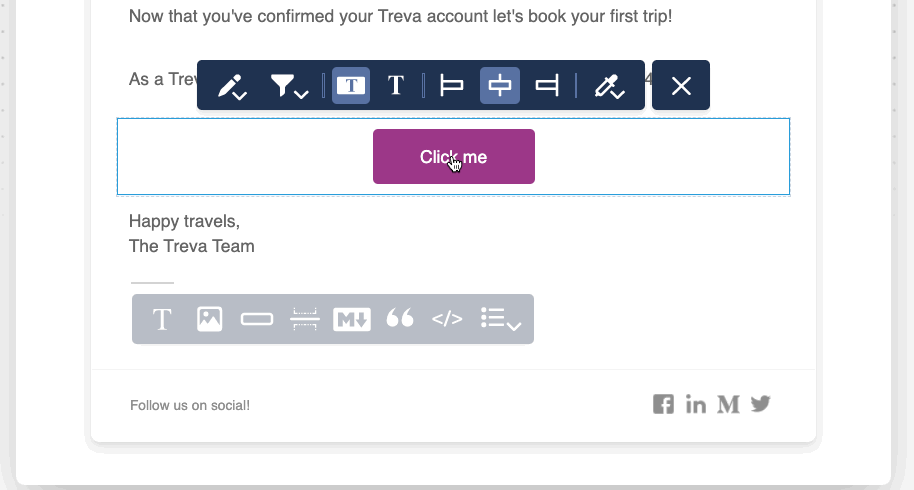

import Image from "@theme/IdealImage";
import GifWrapper from "@site/src/components/GifWrapper";

# Action Blocks

Action Blocks in Courier allow you to add interactive elements to your notifications, enabling recipients to take immediate action directly from the message.
They typically appear as buttons or links, depending on the channel's capabilities.

<Image
  img={require("../../../assets/guides/action-blocks/action-block-new.png")}
  alt="New Action Block"
/>

## Configuring Action Blocks

When you select an action block, you are presented with a toolbar with the following formatting options depending on the notification channel.

<GifWrapper width={920} height={614} caption="Action Block Options">

</GifWrapper>

### Text and Link

- Click the Edit icon to set the `Friendly Text` and `Action`. For most channels, the action is a URL. For Slack, you can opt to use a webhook.

### Button Type

- Select between different button styles, as well as a text-only link option

:::info Note

Action buttons are not available across all channels. For SMS and Chat options, the button will render as a URL.

:::

### Alignment

- Align the content of the block left, center or right.

### Color (Action Buttons Only)

- Select the button color. You can use a color from the palette or enter the hex value for a custom color - or select from pre-defined brand template colors. This option is only available for action buttons.