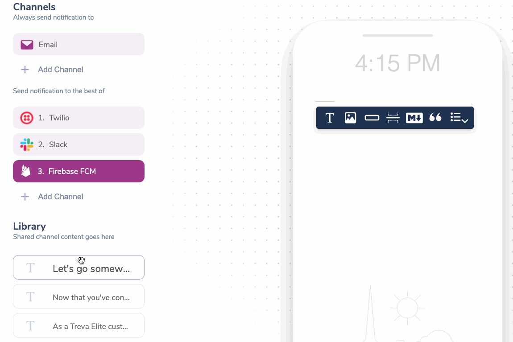

import Image from "@theme/IdealImage";
import GifWrapper from "@site/src/components/GifWrapper";

# Content Block Basics

> Understanding how Content Blocks work, the different Content Block types available in Courier, and their core functionality.

## What is a Content Block?

Content Blocks are drag and drop components that allow you to build notification content which can be reused across your notification channels.

Courier Content Blocks are responsive and cross-channel by default. Content that you create in one channel is available in the Content Library for use in the other channels you add to a notification. 

A few block types, such as `Text` and `Action Blocks`, have channel or integration specific options or formatting. In these cases, Courier automatically makes adjustments when you drag the content in from the shared content Library.

All blocks support [variables](../variables/inserting-variables.mdx) and [filters](../notification-settings/send-conditions.mdx#for-content-blocks).

## Adding Content Blocks to a Notification

When you create a new notification and add delivery channels, you will see the content toolbar. To create a new Content Block, click the block type you wish to add.

<Image
  img={require("../../../assets/guides/block-basics/block-basics-blocks.png")}
  alt="Content Toolbar"
/>

## Content Block Library

The Block Library holds shared channel content. It will display blocks not in use by the selected channel. If a block is not being used by any channel, it will be marked as Unused. Unused blocks can be deleted by hovering over the block and clicking `Remove Block`.

<GifWrapper width={920} height={614} caption="Block Library">

</GifWrapper>

## Filtering Blocks Using Conditions

Blocks can be conditionally hidden using a [filter](../notification-settings/send-conditions.mdx#for-content-blocks). You can add a filter by selecting a block and clicking on the `filter` button.

<Image
  img={require("../../../assets/guides/block-basics/block-basics-conditions.png")}
  alt="Filter Settings"
/>

This will present you with a modal where you can specify the conditions in which the block will be hidden or shown.

<Image
  img={require("../../../assets/guides/block-basics/block-basics-condition-modal.png")}
  alt="Conditional Modal"
/>

You can use values passed in the data object or from the merged recipient profile for the property and values.

## Block Settings

Each content block has block-specific settings. The available settings are block-dependent but include things like alignment, color, and text formatting.

<Image
  img={require("../../../assets/guides/block-basics/block-basics-settings.png")}
  alt="Block Settings"
/>

## Removing a Block

Blocks can be removed from a channel by selecting the block and clicking the Remove Block button. This action will send it to the Block Library.

<Image
  img={require("../../../assets/guides/block-basics/block-basics-delete.png")}
  alt="Remove a Block"
/>