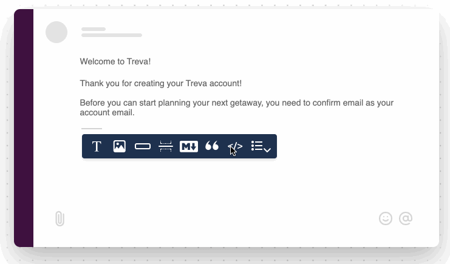

import Image from "@theme/IdealImage";
import GifWrapper from "@site/src/components/GifWrapper";
import YoutubeEmbed from "@site/src/components/YoutubeEmbed";

# Jsonnet Blocks

> A detailed look at Courier's Jsonnet Block functionality, use cases and best practices.

## Working With Jsonnet Blocks

**Availability:** Slack, [Microsoft Teams](../../../platform/channels/direct-message/microsoft-teams.mdx)

<YoutubeEmbed videoId="KPM4lx2Yq3U" />

[Jsonnet](https://learnxinyminutes.com/docs/jsonnet/) is a JSON to JSON templating language, which means that combining Jsonnet with your user data allows you to build and send dynamic, custom Slack blocks and MS Teams Adaptive Cards in your notifications.

<Image
  img={require("../../../assets/guides/jsonnet-blocks/jsonnet-block-new.png")}
  alt="New Jsonnet Block"
/>

## Use Cases

- To help you build common Block Kit actions with Jsonnet, Courier has several Jsonnet template blocks to choose from such as buttons, drop-downs, images, and more.
- You can also build your own [Block Kit](https://api.slack.com/block-kit) elements from scratch. The Jsonnet Block expects a single Block Kit element or an array of elements.

<GifWrapper width={920} height={614} caption="Jsonnet Block">

</GifWrapper>

**Read more:** [Content block basics](content-block-basics.mdx)