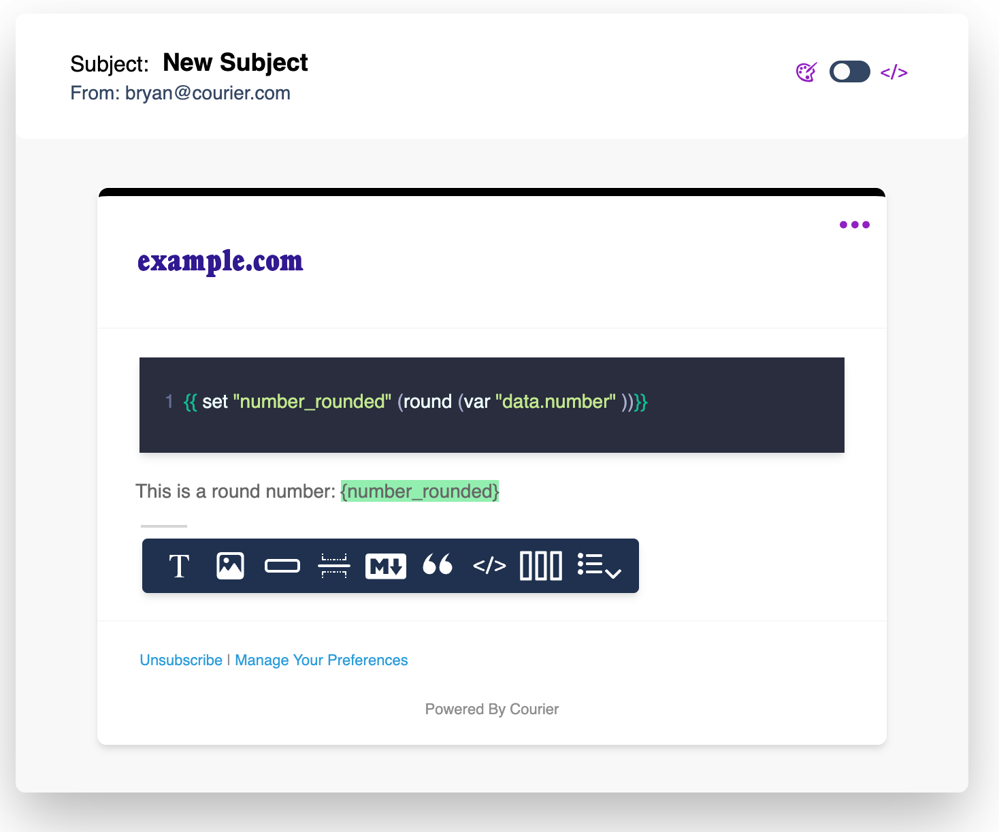
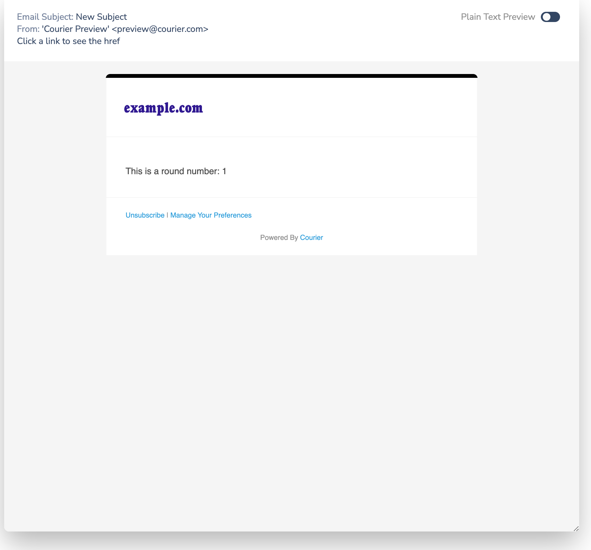

# Handlebars Use Cases

## Simple Use Cases

### Conditionally rendering content

`#if` blocks can be used to control whether content is rendered.

```handlebars
<!-- equal -->
{{#if (condition (var "some_variable") "==" "show")}}
  <div align="center">Hello!</div>
{{/if}}

<!-- strict equal -->
{{#if (condition (var "some_variable") "===" "show")}}
  <div align="center">Hello!</div>
{{/if}}

<!-- not equal -->
{{#if (condition (var "some_variable") "!=" "hide")}}
  <div align="center">Hello!</div>
{{/if}}

<!-- greater than -->
{{#if (condition (var "some_array.length") ">" 0)}}
  <div align="center">Hello!</div>
{{/if}}

<!-- greater than or equal -->
{{#if (condition (var "some_array.length") ">=" 0)}}
  <div align="center">Hello!</div>
{{/if}}

<!-- less than -->
{{#if (condition (var "some_array.length") "<" 0)}}
  <div align="center">Hello!</div>
{{/if}}

<!-- less than or equal -->
{{#if (condition (var "some_array.length") "<=" 0)}}
  <div align="center">Hello!</div>
{{/if}}
```

### Pluralizing Text

The `formatMessage` helper can be used to pluralize text in rendered content. Pluralization respects the [ICU format](https://unicode-org.github.io/icu/userguide/format_parse/messages/) and entries follow [Unicode CLDR rules](https://cldr.unicode.org/index/cldr-spec/plural-rules).

**Example**

```handlebars
Your list contains
{{formatMessage
  "{itemCount, plural,
    =0 {no items}
    one {# item}
    other {# items}
}"
  itemCount=itemCount
}}.
```

## Setting Variables in the payload

Using a Handlebars block, you can transform and set a variable, which can then be used in a template

```handlebars
{{ set "number_rounded (round (var "data.number" )) }}
```

|      Designer                        |      Preview                        |
| :----------------------------------: | :---------------------------------: |
|  |  |

### Using the intl block for localization

You can wrap Handlebars functions with the intl block in order to access internationalization features including currency, number formatting and dates. See [Handlebars-intl](https://github.com/formatjs/handlebars-intl) for more information.

```handlebars
{{#intl formats=intl.formats locales="en-US"}}
  {{set
    "winPct_formatted"
    (formatMessage "{winPct, number, maximumFractionDigits=2}" winPct=(var "data.winPct"))
  }}
{{/intl}}
```
