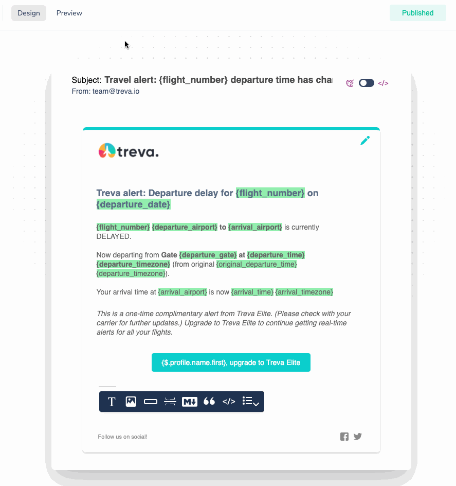
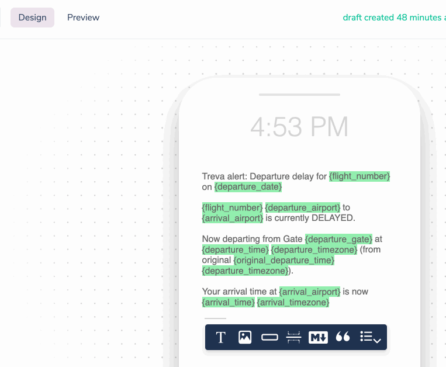
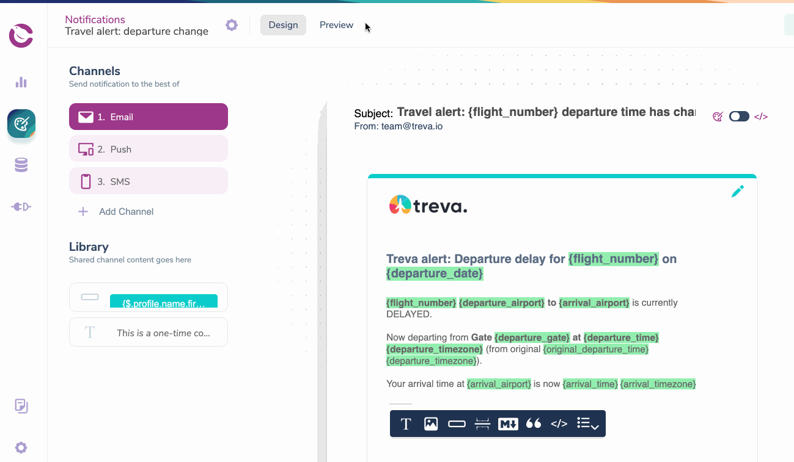

import Image from "@theme/IdealImage";
import GifWrapper from "@site/src/components/GifWrapper";

# How to Preview a Notification Using Test Events

> Step-by-step guide to defining your test events and using the preview function across multiple channels.

The Courier Notification Designer allows you to preview branding, content, test variables or Handlebars code in each channel and send test emails.

## How to Preview Your Notification

To preview a Notification, open it in the Notifications tab of the designer and select `Preview`.

<Image
  img={require("../../../assets/guides/preview-notifications/preview-notification-tab.png")}
  alt="Notification Preview"
/>

### Test Event Required 

When you initially open the preview tab on the demo Welcome to Courier email, there will be a generic "Welcome Example" event with an empty profile. 

This is why any variables you insert into the Example template will not work until you add your own custom Test Event or update the JSON of the Welcome Example.

<Image
  img={require("../../../assets/guides/preview-notifications/preview-notification-test-event.png")}
  alt="New Test Event"
/>

:::info

In order to send an email notification or SMS via the [Send Tab](design-a-notification.mdx), you will need to include an email and/or phone # in the `profile` object of the test event Json.

:::

<Image
  img={require("../../../assets/guides/preview-notifications/preview-notification-test-variable.png")}
  alt="Your Test Event Needs a Complete Profile"
/>

### Previewing Variables

To preview and validate any variables you've built into the Notification, you need to create a Test Event. 

- Click Manage Test Events in the Preview.
- Add valid JSON with values in the data and/or profile objects for your variables.

**Read More:** [JSON Paths](../using-variables/json-paths-variables.mdx) and [Using Substitution Variables](../using-variables/inserting-variables.mdx) in your Notifications.
<!-- Link follow-up doc -->
<Image
  img={require("../../../assets/guides/preview-notifications/preview-notification-test-manage.png")}
  alt="Test Event Variables"
/>

<Image
  img={require("../../../assets/guides/preview-notifications/preview-notification-test-manage-name.png")}
  alt="Test Event Variables"
/>

### Creating a Test Event From the Data Log

When you send an event to Courier, that event can be viewed in the [Data Log](https://help.courier.com/en/articles/4364860-using-the-data-logs). You can turn those events from the data into a test event - it will be located in the preview tab of the event it is mapped to. Open "Event Received" in the Timeline and click "Save as Test Event."

<Image
  img={require("../../../assets/guides/preview-notifications/preview-notification-log-event.png")}
  alt="Create a Test Event From the Logs"
/>

### Email Preview

Email is the only channel that will show a fully rendered image as it will appear to the recipient in the preview. In other channels the preview only allows you to validate the variables.

<GifWrapper width={621} height={661} caption="Preview Your Emails Before Sending">

</GifWrapper>

### Plain Text Preview

The Plain Text Preview toggle lets you switch your Email preview between HTML and plain text versions.

<Image
  img={require("../../../assets/guides/preview-notifications/preview-notification-text.png")}
  alt="Plain Text Preview Toggle"
/>

<Image
  img={require("../../../assets/guides/preview-notifications/preview-notification-text-preview.png")}
  alt="Plain Text Preview"
/>

### SMS Preview

<GifWrapper width={837} height={628} caption="Preview Your SMS Before Sending">

</GifWrapper>

## Other Email Preview Options

### Sending a Test Email

When previewing an Email Notification, you can send a test email by selecting yourself or other members of your Tenant to receive it.

<Image
  img={require("../../../assets/guides/preview-notifications/preview-notification-test-email.png")}
  alt="Send a Test Email"
/>

### Preview Emails Across Multiple Brands 

When previewing an Email, if you have created multiple [Brand Templates](../../brands/how-to-use-brands-to-customize/#customize-your-brands), you can switch between them. If you haven't, then the Email preview will use your [Default Brand design](../../brands/how-to-use-brands-to-customize/#the-default-brand).

<Image
  img={require("../../../assets/guides/preview-notifications/preview-notification-test-brand.png")}
  alt="Select a Brand to Preview"
/>

<GifWrapper width={1299} height={974} caption="Preview Your Email With Your Branding">

</GifWrapper>