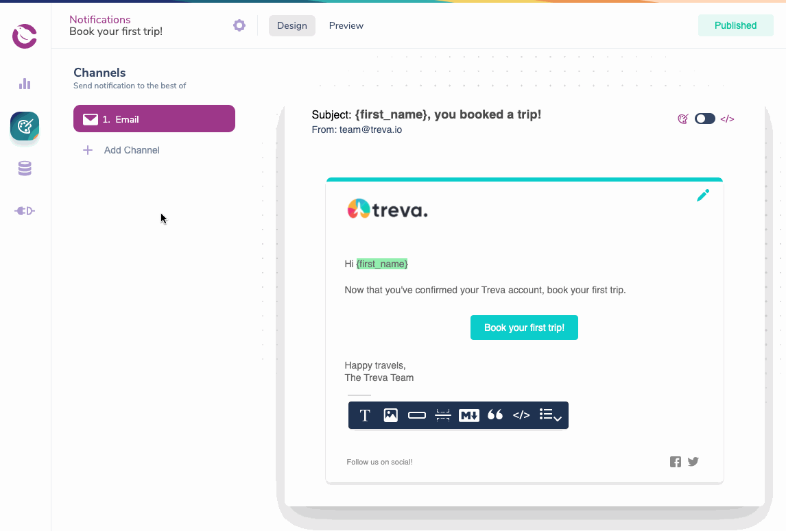
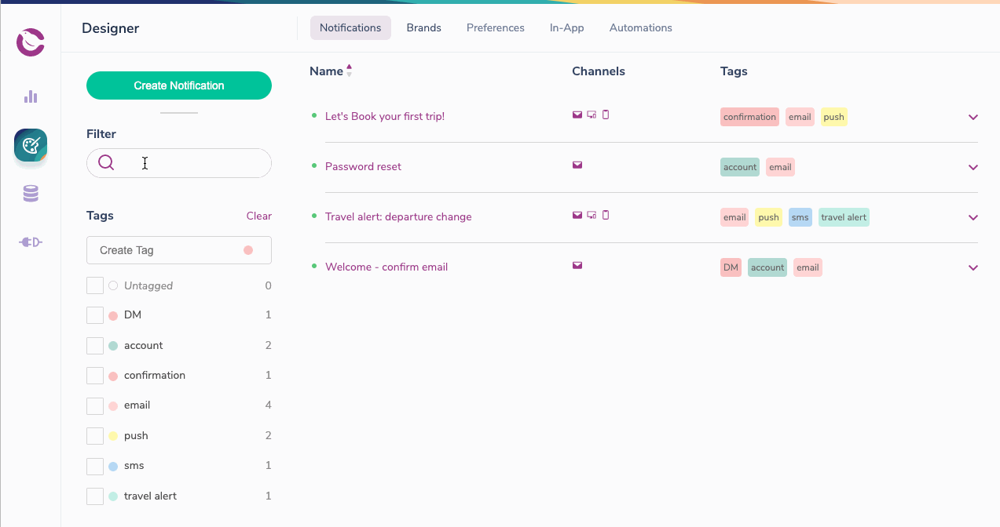

import Image from "@theme/IdealImage";
import GifWrapper from "@site/src/components/GifWrapper";

# Notification Designer Overview

> An introduction to Courier's Notification Designer, empowering every team member to create beautiful, multi-channel notifications.

## Notification Designer

Courier's Notification Designer studio empowers every team member to build beautiful, multi-channel notifications with an easy-to-use graphic user interface.

### Create Notifications

<Image
  img={require("../../../assets/guides/designer-overview/designer-create-notification.png")}
  alt="Create a Notification"
/>

### Add and Prioritize Channels

Add new channels to a Notification with a single click then drag them to reorder their [send priority](../../../platform/sending/channel-priority.mdx).

<GifWrapper width={916} height={620} caption="Add a Channel to Your Notifications">

</GifWrapper>

### Reusable, Drag and Drop Content

Every channel allows you to use drag and drop content blocks to place content without writing any code. Content you create in one channel is available in the Content Library for use in other channels.

- Consistent rendering across every email client.

- Reuse content in any channel.

**Read more:** [How to build a notification that's ready to send](design-a-notification.mdx).

<GifWrapper width={1011} height={616} caption="Reusable Content Blocks">

</GifWrapper>

### Preview Your Notifications

<Image
  img={require("../../../assets/guides/designer-overview/designer-preview.png")}
  alt="Designer Preview"
/>

The Designer allows one to [preview](how-to-preview-notification.mdx) branding, content with test variables, and Handlebars code in every channel.

- Create Test Events to validate your [JSON Paths](../variables/json-paths-variables.mdx) and [dynamic variables](../variables/inserting-variables.mdx). 
- Preview Emails in multiple brands.
- Send preview emails.

<GifWrapper width={710} height={755} caption="Preview Notification">

</GifWrapper>

### Access Notification and Channel Settings

Access the [notification settings](../notification-settings/general-settings.mdx) to set send conditions, configure Brands, view publish history and more. 

<Image
  img={require("../../../assets/guides/designer-overview/designer-notification-settings.png")}
  alt="Notification Settings"
/>

Access the channel settings to manage channel send conditions, reorder integration send priority and delete your channel.

<Image
  img={require("../../../assets/guides/designer-overview/designer-channel-settings.png")}
  alt="Channel Settings"
/>

### View, Search, and Filter Your Notification List

Use the search field to locate a Notification by name, channel or tag. Create tags and then use the tag filter to narrow your list view.

<GifWrapper width={1018} height={538} caption="Filter Your Notifications">

</GifWrapper>

## Brand Designer

The Brand Designer lets you give your email notifications a consistent look and feel for you and your customers.

### Create and Apply Consistent Branding Across Notifications

- Branded email templates
- Reusable brand code snippets
- White-labeled email branding

Read more about [customizing and using Brands](../brands/brands-in-email-notifications.mdx).

<Image
  img={require("../../../assets/guides/designer-overview/designer-branding.png")}
  alt="Brand Designer"
/>
