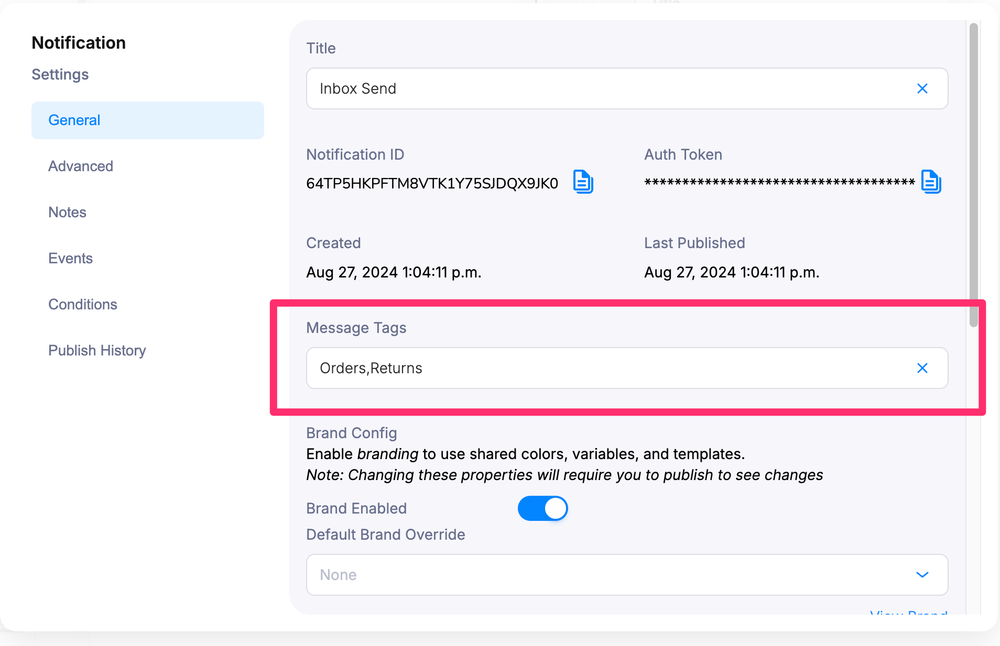

import Image from "@theme/IdealImage";

# General Settings

> A quick introduction to the Notification settings: where they are, what information they provide and what you can do with them.

The Notification settings contain important information required to send the notification along with settings that define how email notifications look, when your notification sends, and its publish history.

There are five sections of the Notification Settings.

- General
- Notes
- Events
- Conditions
- Publish History

## Opening the Notification Settings

To view the Notification settings, open the notification in the designer list, then click the settings icon next to the Notification name.

<Image
  img={require("../../../assets/guides/notification-settings/notification-settings-main.png")}
  alt="Access Notification General Settings"
/>

## General Settings

<Image
  img={require("../../../assets/guides/notification-settings/notification-settings-general.png")}
  alt="General Settings"
/>

### Notification ID

- The Notification ID is a unique string assigned to the notification by Courier.
- When you make a successful Send API request, Courier returns the Notification ID mapped to the event used to trigger it.
- You can also use the Notification ID as the event object in your Send

### Auth Token

- A Tenant-level token required to send Notifications.
- You can also find your Tenant's AuthToken in the [General Settings](https://app.courier.com/settings).

### Brand Config

- Brands are "enabled" by default so each new email notification will use your [Default Brand](../../brands/brands-in-email-notifications/#customize-your-brands) template unless you disable it.
- Brands must be "enabled" to use [Custom Brands](../../brands/brands-in-email-notifications/#send-a-branded-email-notification) on email notifications.

### Subscription Topic
- Use Subscription Topic to group notification templates and let end users set preferences to more than one notification at a time.

### Message Tags

:::note 
This is under a feature flag currently, please reach out to Courier support or your account team to turn on.
:::

- While designing a template, you may want to select which view you would like this appear in an inbox or how to internally tag your messages. 
- You can enter a comma seperated list of tags and those will automatically be put into the `metadata.tags` [docs](../../../../reference/send/message/#the-metadata-property) field when sending to the user. 
- This allows them to be filtered in a view on the inbox using one of those tags or filtered with our [Messages API](../../../../reference/logs/list).

### Notification Config

- Even if you've assigned a notification to a Category, you can define whether or not you want the notification to inherit settings from the category or define them at the Notification level with this setting.

<Image
  img={require("../../../assets/guides/notification-settings/notification-settings-config.png")}
  alt="Configuration Settings"
/>

### Created

- Timestamp of when the notification was created.

### Duplicate

- The Duplicate button allows you to duplicate all content, channels and configurations created in this notification into a new notification.
- The duplicate will not share the same Notification ID.

### Delete

- The Delete button permanently deletes the notification and all its content.

## Notes

<Image
  img={require("../../../assets/guides/notification-settings/notification-settings-notes.png")}
  alt="Notification Notes"
/>

Notes let you create and edit an internal note about the Notification. Once a note has been added, you'll see a new note icon in the main notifications list – clicking this opens a read-only view of the note directly within the list view.

<Image
  img={require("../../../assets/guides/notification-settings/notification-settings-notes-designer.png")}
  alt="Notification Designer Overview"
/>

## Events

You can map an existing Event trigger to the notification in the Events section of the Notification settings.

<Image
  img={require("../../../assets/guides/notification-settings/notification-settings-events.png")}
  alt="Event Mapping Settings"
/>

**Read more:** [Creating Events](../../sending/create-map-events.mdx)

## Conditions

Using the Conditions tool in the Notification settings allows you to use properties from the data or profile objects provided by the [Send API](../../../reference/send/intro.mdx) call or [User Profile](../../../reference/profiles/intro.mdx) to prevent the notification from sending when specific conditions are met.

## Publish History

- Publish History allows you to see who published versions of the Notification and when they published it.
- Rollback allows you to revert to any previously published version.

:::caution Note

You will lose any unpublished work if you click **Rollback**.
:::

<Image
  img={require("../../../assets/guides/notification-settings/notification-settings-history.png")}
  alt="Notification Versioning"
/>
