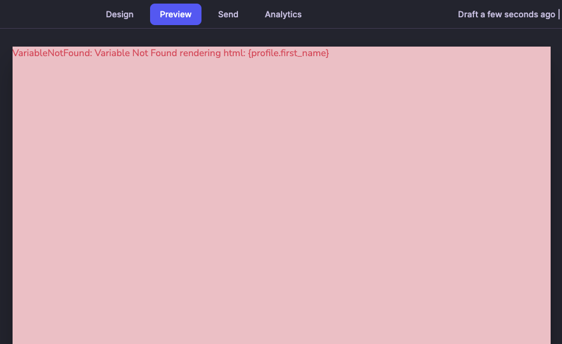
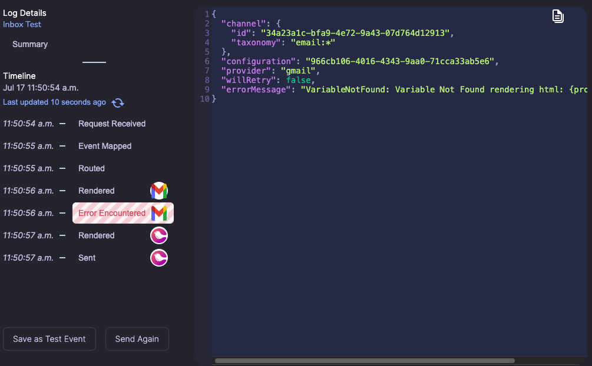
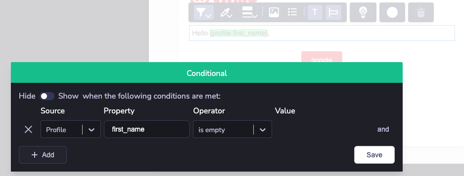

# Throw on Variable Not Found (Beta)

:::note
Throw on Variable Not Found is currently in Public Beta and under active development. Please provide feedback in Discord or with your account team on Slack
:::

Throw on Variable Not Found is a feature that can be toggled within a notification template Settings page under the Advanced section. When turning this feature on, Courier will prevent any channel from sending a message where variables were not fulfilled. For example, if you have a block of text on your email template that says `Hello {profile.first_name},` but the Courier profile doesn't have first_name and first_name wasn't provided in the Send API call, then we will throw an error while rendering this email template.

The feature is available when rendering a Preview Test event and visible within Message Log render events

**Preview**

**Logs**

## Conditional Blocks and Conditional Text

This feature runs its check after all conditionals have been evaluated and only checks the final blocks that will be sent to the provider. For example,

1. Put a conditional on profile.first_name for a text block
1. Use `{profile.first_name}` within that block
1. Courier renders the template, but doesn't render that block because it fails the condition
1. Throw on Variable Not Found will not invoke, and the render will succeed and send

**Example**

The screenshot above is a conditional on the visible text block. If profile.first_name does not exist, the text block will not display. Throw on Variable Not Found will not affect this message.

## Multiple channels

If you are sending to multiple channels and each provider has different variables, only the channel that fails the check will fail to send. For example, if using `{profile.first_name}` in an email template but not in a Courier Inbox template, then Email will fail to render and send if I do not have a profile.first_name, but the Inbox will render and send it successfully.
