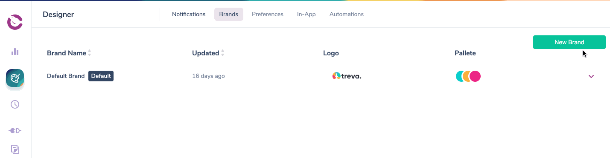

import YoutubeEmbed from "@site/src/components/YoutubeEmbed";
import Image from "@theme/IdealImage";
import GifWrapper from "@site/src/components/GifWrapper";

# How to Use Brands to Customize Email Notifications

Courier's Brands feature lets you give your email notifications a consistent look and feel for you and your customers.

## Brand or White-Label your Email Notifications

Courier's Brands feature set lets you apply a consistent look and feel to your email notifications. You can also use this feature to _white-label_ email notifications you send on behalf of your customers to their end-user recipients or if you have multiple brands internally.

Courier Brands are also fully API enabled. Developers can get, create, update and delete brands programmatically using our [Brands API](../reference/brands/intro.mdx).

<YoutubeEmbed videoId="AR5joIs9Zeo" />

### Using Your Default Brand

Your default brand, along with any custom brand, can be customized and renamed. The default brand cannot be deleted.

_Customizing your default brand is important because:_

- Every email notification you create uses the Default Brand unless you manually disable Brands in the Notification settings.

- If you enable brands on a notification, your Default Brand will be the fallback for any Send API call that does not specify a brand in the user profile.

## Creating a New Brand

- To create a new brand open the notification Designer, select **Brands** in the top menu and click **New Brand**.
- Giving your Brand an optional `brand_id` will allow your developers to manage your brand programmatically using the Brands API.

<GifWrapper width={845} height={475} caption="New Brand Modal">



</GifWrapper>

### Setting a Custom Brand as your Default

To set a custom brand as your default, open the brand settings and click Set As Default.

<Image
  img={require("../assets/guides/courier-app/set-brand-as-default.png")}
  alt="Brands Settings"
/>
<Image
  img={require("../assets/guides/courier-app/brand-settings.png")}
  alt="Brand Settings Modal"
/>

## Customizing your Brands

### Use the Notification Designer to customize a Brand

Using the Notification Designer you can create and customize your Brands in the following ways:

- Name
- Logo ([dimensions and requirements](../platform/content/brands/how-to-use-brands-to-customize.mdx)).
- Brand colors (Primary, Secondary, Tertiary)
- Brand Header color
- Brand Footer Social links

### Use a Custom Template to create your brand look

If you prefer, you can use code to customize your Brand header and footer by selecting the _Use Custom Template_ option in the Brand Designer.

Custom Templates combine the best of both worlds by allowing you to ensure brand consistency using Handlebars and HTML or [MJML](https://mjml.io/) to customize the header, footer and email body background while using the drag & drop content designer to create the body of the email with content blocks that can be reused across channels.

<Image
  img={require("../assets/guides/courier-app/brand-custom-template.png")}
  alt="Brand Custom Template"
/>

### Customize your Brand Template CSS

You can customize the `<style>` element in the `<head>` section of your Brands using custom templates as well as brands built using the Designer UI. Read more about Courier's [CSS Classnames](../platform/content/brands/css-classnames.mdx).

### Preview your Brand-Enabled Email Notifications

To preview what your email notification will look like with different brands applied, open the **Preview** then select the **Brand** from the **Preview Details > Brand** menu.

<Image
  img={require("../assets/guides/courier-app/brand-preview-details.png")}
  alt="Notification Preview Details"
/>

### Customizing your brand using variables

Any brand attribute you can customize in the brand designer UI, you can also set via variables like `{{var "brand.social.facebook"}}` for example.

Here is the schema for the brand information accessible via variables:

```js
export const getBrandVariables = (
  brand?: IBrand
): {
  id?: string;
  colors?:
    | {
        primary: string;
        secondary: string;
        tertiary: string;
      }
    | {};
  email?: {
    header: {
      barColor?: string;
      logo: {
        href?: string;
        image?: string;
      };
    };
  };
  social?: {
    facebook?: string;
    instagram?: string;
    linkedin?: string;
    medium?: string;
    twitter?: string;
  };
}
```

## Create Custom, Reusable Code With Snippets

Snippets are pieces of [handlebars](https://handlebarsjs.com/) code that you can copy and paste or pull into a Template Block using the snippet name.

<Image img={require("../assets/guides/courier-app/brand-snippet.png")} alt="Brand Snippet" />

To use Snippets add a **Template Block** to an email Notification, and simply call it using a Template Block: `{{>snippet_name}}`

<Image
  img={require("../assets/guides/courier-app/brand-snippet-block.png")}
  alt="Brand Snippet Block"
/>

Using the Notification preview allows you to see the Snippet rendered:

<Image
  img={require("../assets/guides/courier-app/brand-snippet-preview.png")}
  alt="Brand Snippet Preview"
/>

### Customize your Snippet Content Using Variables

You can use variables to pull customized content into the Snippet, supplying the value for the variable inside the user profile sent via the Send API call.

<Image
  img={require("../assets/guides/courier-app/brand-snippet-variables.png")}
  alt="Brand Snippet Variables"
/>

### Snippets and the Default Brand

If a snippet exists in the default brand, but not in a custom brand, the default brand snippet _will_ render in the custom brand as long as there isn't a snippet with the same name native to that custom brand.

This means you can put any or all of your snippets in the default brand and call them into multiple custom brands. Think of custom brands as extending the default. They can still have their own custom snippets as well.

## Sending a Branded Email Notification

1. The Notification must be brand enabled in the Notification Settings.
2. Include a Brand ID in the Send API call (if no Brand ID is provided, Courier will send using the Default Brand. See the [Send API documentation](../reference/send/intro.mdx) for details.

<Image
  img={require("../assets/guides/courier-app/brand-notification-settings.png")}
  alt="Brand Notification Settings"
/>

**Watch:** [Courier live: building and sending whitelabel emails via the Brands API.](https://help.courier.com/en/articles/4313169-courier-live-branding-and-white-labeling-email-notifications)
